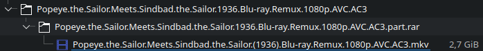

NzbStreamer
===

Presents files described by NZBs from Newsservers on-demand as WebDAV or FUSE with caching & unpacking multi-part-rar and -7z containers.  



---

<!-- TOC -->
- [1. Description](#1-description)
- [2. Usage](#2-usage)
    - [2.1. How to run](#21-how-to-run)
- [3. Problems](#3-problems)
    - [3.1. Segment- and File-sizes](#31-segment--and-file-sizes)
    - [3.2. Archive-Files](#32-archive-files)
- [4. Settings](#4-settings)
- [5. Feature-List](#5-feature-list)
- [6. License](#6-license)
<!-- /TOC -->

# 1. Description

NzbStreamer streams files described by NZBs from Newsservers on-demand via WebDAV or FUSE, with caching and unpacking of multi-part containers like rar and 7z.  
It allows streaming from Usenet without downloading first, using minimal disk space.  
This tool fills the gap left by other tools that are either incompatible or too narrow in scope, aiming to integrate seamlessly with tools like Sonarr and Radarr.

# 2. Usage

On startup, NzbStreamer loads existing NZB files, skipping any with errors. It can start a WebDAV server and/or mount a FUSE filesystem. When a file segment is read, it downloads, assembles, and presents the data. New NZB files added via triggers are parsed, checked, assembled, and made available via the filesystem if they pass plausibility checks.

## 2.1. How to run

### 2.1.1. Docker-compose

Example Compose file with Webdav, Fuse and custom file-blacklist:

```yaml
services:
    nzbstreamer:
        image: nzbstreamer
        volumes:
            - ./cache:/app/.cache
            - ./watch:/app/.watch
            - ./mount:/mount:rshared
        ports:
            - 127.0.0.1:8080:8080
        environment:
            USENET_HOST: your_usenet_host
            USENET_PORT: 563
            USENET_USER: your_usenet_user
            USENET_PASS: your_usenet_pass
            FILESYSTEM_BLACKLIST: "(?i)\\.par2$,(?i)\\.r(ar)?\\d*$,(?i)\\.7z(ip)?\\d*$,(?i)\\.z\\d*$,(?i)\\.zip$,(?i)((^|\\W)(sample|preview)\\W)"
            MOUNT_PATH: /mount
        security_opt:
            - apparmor=unconfined
        cap_add:
            - SYS_ADMIN
        devices:
            - /dev/fuse
```

<br>

Because of the fuse-mount inside the container, several options are required to be set for the mount to work properly:
1. The volume must be mounted with the `rshared` option to allow the propagation of mount events to the host. 
This is required if you want to use the mount on the host or in a different container.
2. apparmor must be disabled for the container to allow the use of FUSE.
3. The container must have the `SYS_ADMIN` capability to allow the use of FUSE.
4. The `/dev/fuse` device must be accessible to the container.

# 3. Problems

## 3.1. Segment- and File-sizes
As the exact size of a segment-data amount isnt known, the program has to rely on the NZB-segment annotation `bytes`, which describes the packed-size of the segment including header and checksum. It is usuall 2-5% larger.

The segment-size is important for determining which segments need to be read next or more importantly where to jump to in case a different part of the file is requested.

The program already compensates for this by checking if the size is close to a known segment-size.  
But this isnt possible in al circumstances, usually for end-segments, and can lead to the file displayed to be slightly smaller than it actually is.

Usually this isnt an issue as the real file will only differ by a few KB, but accessing the file via WebDAV might result in errors when trying to read the whole file as WebDAV expects the file to be static.

This problem doesnt exist, when the file is from within an archive as the archive knows the actual file-size.  
Though this can cause other problems, see below.

## 3.2. Archive-Files
When a file is from within an archive, the program has to unpack the archive to get the file.  

As these are usually compressed in a single stream, the archived-file has to be read from the beginning, until the requested part is read.   This works fine for sequencial reads, but can cause problems when the file is read in a non-sequencial order.  
i.e. Reading a part from end causes the whole archive to be read until the end.

The current implementatiion also doesnt handle seeking backwards, so reading a part early from the current stream causes the whole archive to be read from the beginning again until the part is reached.

If all files within an archive are compressed in a single stream (typically called "Solid") or in seperate ones, depends on the type of archive.  

Specially video-files like mkv are problematic as some metadata required for playback typically resides at the end of the file unless moved to the front. (e.g. Keyframe-index)

# 4. Settings

| Name                              | Default                | Description                                      |
|-----------------------------------|------------------------|--------------------------------------------------|
| **Usenet**
| `USENET_HOST`*                    |                        | Usenet server host                               |
| `USENET_PORT`                     | 563                    | Usenet server port                               |
| `USENET_TLS`                      | true                   | Use TLS for Usenet connection                    |
| `USENET_USER`*                    |                        | Usenet username                                  |
| `USENET_PASS`*                    |                        | Usenet password                                  |
| `USENET_MAX_CONN`                 | 20                     | Maximum Usenet connections to use                |
| **Trigger**
| `FOLDER_WATCHER_PATH`             | .watch                 | Watch folder for adding nzbs (blackhole folder)  |
| **Presenters**
| `WEBDAV_ADDRESS`                  | :8080                  | Address for WebDAV server; Disabled when unset   |
| `WEBDAV_USERNAME`                 |                        | Username for WebDAV basic auth; Authentication disabled when unset |
| `WEBDAV_PASSWORD`                 |                        | Password for WebDAV basic auth                   |
| `MOUNT_PATH`                      |                        | Path for FUSE mount; Disabled when unset         |
| `MOUNT_OPTIONS`                   |                        | Additional Options for FUSE mount; See mount.fuse3 Manpage for more information |
| **Cache**
| `CACHE_PATH`                      | .cache                 | Path for segment-cache                           |
| `CACHE_MAX_SIZE`                  | 0                      | Maximum cache size in bytes, if unset allows unlimited size (not recommended) |
| **Readahead-Cache**
| `READAHEAD_CACHE_AVG_SPEED_TIME`  | 0.5s                   | Time over which average read speed is calculated |
| `READAHEAD_CACHE_TIME`            | 1s                     | Readahead time                                   |
| `READAHEAD_CACHE_MIN_SIZE`        | 1048576                | Minimum readahead amount in bytes                |
| `READAHEAD_CACHE_LOW_BUFFER`      | 1048576                | Buffer size that triggers readahead in bytes     |
| `READAHEAD_CACHE_MAX_SIZE`        | 16777216               | Maximum readahead amount in bytes; Disables readahead-cache when 0                |
| **Nzb-Options**
| `NZB_FILE_BLACKLIST`              | (?i)\.par2$            | Early Regex-blacklist, immediately applied after nzb-file is scanned <br>Can be used to skip unwanted files like .par2 |
| `NZB_TRY_READ_BYTES`              | 1                      | Bytes to try to read when scanning files         |
| `NZB_TRY_READ_PERCENTAGE`         | 0                      | Percentage of file to try to read when scanning files |
| `NZB_FILES_HEALTHY_THRESHOLD`     | 1.0                    | Above this percentage-threshold, try-read errors are allowed |
| **Filesystem-Options**
| `FILESYSTEM_BLACKLIST`            |                        | Late Regex-blacklist, applied on the actual file added to the filesystem; includes files from archives <br>Can be used to hide archive-files, but leaving unpacked files |
| `FILESYSTEM_FLATTEN_MAX_DEPTH`    | 1                      | Unpacks files from folders e.g. archives where possible <br>Can be used to hide archive-group-folder |
| `FILESYSTEM_FIX_FILENAME_THRESHOLD`| 0.2                   | Threshold for applying filename-fixing when filename doesnt match nzb meta name |
| **Misc**
| `LOGLEVEL`                        | INFO                   | Logging level, one of {DEBUG, INFO, WARN, ERROR} |

*\* Required*

# 5. Feature-List

-   Triggers
    -   [x] Blackhole-folder
    -   [ ] SabNzb-API
        -   [x] Optionally store loaded Nzb in folder
-   Presenters
    -   [x] WebDAV
    -   [x] FUSE
-   Files
    -   Archives
        -   [x] Multipart-Rar
        -   [x] Multipart-7z
        -   [ ] Multipart-Zip
    -   [x] Blacklist
    -   [x] Flatten folders
        -   Needs fixing
    -   [x] Deobfuscate names
    -   [ ] Path templating
-   NZB options
    -   [x] File Blacklist
    -   [ ] Scan segments
        -   [ ] Amount / Percentage
        -   [ ] Unknown sizes
        -   [ ] Periodic rescan
-   Cache
    -   [x] Readahead cache
    -   [x] Segment-Cache
        -   [x] Max Size
        -   [ ] Max TTL
    -   [ ] Segment-Metadata-Cache
    -   [ ] Filesystem cache
        -   High-level cache for reduced disk actitivy for compressed archives
-   Internals
    -   [x] Efficient seeking
    -   [ ] Choose efficient Segment-Merger
        -   If we know the size of all Segments, we should use a more efficient merger
    -   [ ] Segment-Merger efficient copying
        -   If we know the size of Segments in a sequence, we should directly write those to out-buffer
    -   [ ] Properly handle Missing articles -> Remove file
        -   Currently only the error is logged
    -   [ ] Nzb Store for more permanent storage
    -   [ ] More efficient opening (and thus reserving) of resources

# 6. License

This program is free software: you can redistribute it and/or modify
it under the terms of the GNU Affero General Public License as published
by the Free Software Foundation, either version 3 of the License, or
(at your option) any later version.

This program is distributed in the hope that it will be useful,
but WITHOUT ANY WARRANTY; without even the implied warranty of
MERCHANTABILITY or FITNESS FOR A PARTICULAR PURPOSE.  See the
GNU Affero General Public License for more details.

You should have received a copy of the GNU Affero General Public License
along with this program.  If not, see <http://www.gnu.org/licenses/>.
