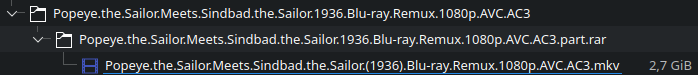

# NzbStreamer

[](https://github.com/Ruakij/NzbStreamer/actions/workflows/ci.yaml)
[](https://github.com/Ruakij/NzbStreamer/releases)
[](https://github.com/Ruakij/NzbStreamer/pkgs/container/nzbstreamer)
[](#4-routes)
[](go.mod)
[](LICENCE)

**Presents files described by NZBs from Newsservers on-demand as WebDAV or FUSE, unpacking multi-part rar and 7z containers on the way.**



---

<!-- TOC -->
- [NzbStreamer](#nzbstreamer)
- [1. Description](#1-description)
- [2. Usage](#2-usage)
  - [2.1. How to run](#21-how-to-run)
    - [2.1.1. Docker-compose](#211-docker-compose)
- [3. Problems](#3-problems)
  - [3.1. Segment- and File-sizes](#31-segment--and-file-sizes)
  - [3.2. Archive-Files](#32-archive-files)
- [4. Routes](#4-routes)
- [5. Settings](#5-settings)
- [6. Feature-List](#6-feature-list)
- [7. License](#7-license)
<!-- /TOC -->

# 1. Description

NzbStreamer streams files described by NZBs from Newsservers on-demand via WebDAV or FUSE, with caching and unpacking of multi-part containers like rar and 7z.  
It allows streaming from Usenet without downloading first, using minimal disk space.  
This tool fills the gap left by other tools that are either incompatible or too narrow in scope, aiming to integrate seamlessly with tools like Sonarr and Radarr.

# 2. Usage

On startup, NzbStreamer restores what it added before from its metadata database, without touching the news server. It can start a WebDAV server and/or mount a FUSE filesystem. When a file segment is read, it downloads, assembles, and presents the data. New NZBs arrive through the watch folder, the SABnzbd api or the web ui; each is parsed, sampled to judge whether enough of it is still on the server, and presented if it passes.

## 2.1. How to run

### 2.1.1. Docker-compose

Example Compose file with Webdav, Fuse and custom file-blacklist:

```yaml
services:
    nzbstreamer:
        image: ghcr.io/ruakij/nzbstreamer
        volumes:
            - ./cache:/app/.cache
            - ./watch:/app/.watch
            - ./metadata:/app/.metadata
            - ./mount:/mount:rshared
        ports:
            - 127.0.0.1:8080:8080
        environment:
            USENET_1_HOST: your_usenet_host
            USENET_1_PORT: 563
            USENET_1_USER: your_usenet_user
            USENET_1_PASS: your_usenet_pass
            FILESYSTEM_BLACKLIST: "(?i)\\.par2$,(?i)\\.r(ar)?\\d*$,(?i)\\.7z(ip)?\\d*$,(?i)\\.z\\d*$,(?i)\\.zip$,(?i)((^|\\W)(sample|preview)\\W)"
            MOUNT_PATH: /mount
        security_opt:
            - apparmor=unconfined
        cap_add:
            - SYS_ADMIN
        devices:
            - /dev/fuse
```

<br>

Because of the fuse-mount inside the container, several options are required to be set for the mount to work properly:
1. The volume must be mounted with the `rshared` option to allow the propagation of mount events to the host. 
This is required if you want to use the mount on the host or in a different container.
2. apparmor must be disabled for the container to allow the use of FUSE.
3. The container must have the `SYS_ADMIN` capability to allow the use of FUSE.
4. The `/dev/fuse` device must be accessible to the container.

The image runs as uid 1000, so every bind-mounted directory must be writable by it, and the mountpoint must be owned by it, which is what `fusermount` checks before mounting for a non-root user. `chown 1000:1000 cache watch metadata mount` covers it; pass a different `user:` if that uid does not fit.

# 3. Problems

## 3.1. Segment- and File-sizes
An NZB annotates each segment with `bytes`, but indexers disagree on what it counts: the posted size including yEnc overhead, 2-5% larger than the payload, or the decoded size. That decides which segment an offset falls in, so a wrong one sends a seek to the wrong place.

The convention is derived from the hints, or settled by downloading up to `NZB_PROBE_SIZE_CONVENTION` segments while adding. Decoded lengths are kept in the metadata database by message-id, so every full segment is then exact and only a file's last segment is a guess. That one is measured while adding for the classes in `NZB_EAGER_EXACT_SIZE_CLASSES`, and otherwise on the first GET needing a `Content-Length` unless `WEBDAV_LAZY_EXACT_SIZE` is off, which truncates the response instead.

Where nothing settles the convention, a seek downloads whatever it crosses the first time.

## 3.2. Archive-Files
Cost depends on how the member was stored.

A **stored** (uncompressed) member, which most video releases are, seeks by block offset within the volumes: no decoder, cost proportional to the bytes wanted, backwards as cheap as forwards, concurrent reads in parallel.

A **compressed** or **solid** member, and anything out of a 7z, is a forward-only decoder stream: seeking backwards decodes from the start again, cost is proportional to the offset, and concurrent reads serialise behind the one decoder. Video files show this, since the index a player seeks with usually sits at the end of the file.

Zip archives are not unpacked.

# 4. Routes

| Path                                | Description                                                   |
|-------------------------------------|--------------------------------------------------------|
| `/`                                 | Web ui showing the queue and history |
| `/sabnzbd/api`                      | SABnzbd-compatible download client api; a client's url base is `http://host:8080/sabnzbd` |
| `/webdav/`                          | WebDAV, behind basic auth when `WEBDAV_USERNAME` is set |
| `/api/health`                       | Readiness: 200 when the store, cache and mount are up, 503 otherwise; the body reports every component, news servers included |
| `/api/health/live`                  | Liveness: 200 while the process answers, looking at nothing else |
| `/debug/pprof/`, `/debug/statsviz/` | Debugging endpoints, off unless `HTTP_DEBUG`                                |

# 5. Settings

| Name                              | Default                | Description                                      |
|-----------------------------------|------------------------|--------------------------------------------------|
| **Usenet server**, once per server, `n` counting up from 1
| `USENET_n_HOST`*                  |                        | Usenet server host                               |
| `USENET_n_PORT`                   | 563                    | Usenet server port                               |
| `USENET_n_TLS`                    | true                   | Use TLS for Usenet connection                    |
| `USENET_n_USER`*                  |                        | Usenet username                                  |
| `USENET_n_PASS`*                  |                        | Usenet password                                  |
| `USENET_n_MAX_CONN`               | 20                     | Maximum Usenet connections to use                |
| `USENET_n_PRIORITY`               | n                      | Priority, lower is chosen first; servers sharing a priority share the load round robin |
| `USENET_n_QUOTA_BYTES`            | 0                      | Bytes this server may serve per period; 0 is unmetered |
| `USENET_n_QUOTA_PERIOD`           | 720h                   | Quota-lifetime |
| **Usenet**, shared by every server
| `USENET_MAX_ATTEMPTS`             | 3                      | Attempts a request gets before its error is reported |
| `USENET_RETRY_BACKOFF`            | 1s                     | Wait after the first failed attempt, doubled after each further one |
| `USENET_TIMEOUT`                  | 30s                    | Timeout for connecting and for completing a single request |
| `USENET_IDLE_TIMEOUT`             | 2m                     | Time after which an unused connection is closed |
| `USENET_BREAKER_FAILURES`         | 3                      | Consecutive failures which disables uisng a server for cooldown-time; 0 never disables |
| `USENET_BREAKER_COOLDOWN`         | 5m                     | How long a disabled server waits for |

One server is `USENET_1_HOST` and its siblings; add more by counting up. The
unindexed form (`USENET_HOST`) is nr. 1 too.

`PRIORITY` decides the order: lower is chosen first, higher ones are the fallback. Servers sharing a priority are used simultaniously via round robin.
Defaults to the index, e.g. `USENET_1_PRIORITY` defaults to 1, `USENET_2_PRIORITY` to 2.

| Name                              | Default                | Description                                      |
|-----------------------------------|------------------------|--------------------------------------------------|
| **Trigger**
| `FOLDER_WATCHER_PATH`             | .watch                 | Watch folder for adding nzbs                     |
| `FOLDER_WATCHER_CONSUME`          | true                   | Delete an nzb file once it has been added; the metadata database keeps it |
| **Http**
| `HTTP_ADDRESS`                    | :8080                  | Address the process listens on; serves the web ui, its api, `/sabnzbd/api` and `/webdav/` |
| `HTTP_DEBUG`                      | false                  | Serve `/debug/pprof/` and `/debug/statsviz/`     |
| **Presenters**
| `WEBDAV_USERNAME`                 |                        | Username for WebDAV basic auth; Authentication disabled when unset |
| `WEBDAV_PASSWORD`                 |                        | Password for WebDAV basic auth                   |
| `WEBDAV_LAZY_EXACT_SIZE`          | true                   | Measure the exact size of a file on the GET that needs it, where doing so is cheap, so `Content-Length` is right for one `NZB_EAGER_EXACT_SIZE_CLASSES` left out <br>Disabling it answers every GET from the size hint, which for an estimated size means a truncated response |
| `MOUNT_PATH`                      |                        | Path for FUSE mount; Disabled when unset         |
| `MOUNT_OPTIONS`                   |                        | Additional Options for FUSE mount; See mount.fuse3 Manpage for more information |
| **Download-Client-Api**
| `SABNZBD_API_KEY`                 |                        | Api key demanded of every request; unauthenticated when unset |
| `SABNZBD_COMPLETE_DIR`            |                        | Path reported to a client as the completed-downloads folder, which is where it imports from; defaults to `MOUNT_PATH` |
| `SABNZBD_CATEGORIES`              | *,tv,movies            | Categories offered to a client; it refuses to save if the one it is configured with is missing |
| **Cache**
| `CACHE_PATH`                      | .cache                 | Path for segment-cache                           |
| `CACHE_MAX_SIZE`                  | 0                      | Maximum cache size in bytes, if unset allows unlimited size (not recommended) |
| **Metadata**
| `METADATA_PATH`                   | .metadata/metadata.db  | Path for the metadata database; WAL puts two sibling files next to it |
| **Prefetch**
| `PREFETCH_TIME`                   | 1s                     | How far ahead of the read position to stay warm, in read-time |
| `PREFETCH_MIN_SEGMENTS`           | 4                      | Segments warmed ahead before a read speed can be measured |
| `PREFETCH_MAX_SEGMENTS`           | 16                     | Upper bound on segments warmed ahead; 0 disables prefetching |
| `PREFETCH_MAX_CONN`               | 0                      | Concurrent prefetches across all files; defaults to the sum of the servers connections when 0 |
| `PREFETCH_QUEUE_MARGIN`           | -1                     | How many fetches may be waiting for a free connection before prefetch stops queueing more; 0 queues only while none are, negative defaults to a quarter of the connections of the servers currently active <br>Higher overcommits the connections and can keep them better utilized, at the cost of later requests waiting longer or being refused by the backpressure |
| **Nzb-Options**
| `NZB_FILE_BLACKLIST`              |                        | Early Regex-blacklist, applied after the nzb-file is scanned <br>A file dropped here is not health-checked either, and .par2 dropped here leaves the check without its repair-capacity estimate |
| `NZB_PROBE_SIZE_CONVENTION`       | 3                      | Segments of an nzb whose size hints do not identify what they count that may be downloaded to settle it, making its sizes exact <br>A segment that settles nothing costs the next attempt; 0 leaves the sizes as estimates until a read has measured them |
| `NZB_EAGER_EXACT_SIZE_CLASSES`    | content                | File classes measured while an nzb is added, so a listing reports their exact size before anything has read them <br>`content`, `recovery`, `other`, comma-separated, or empty for none. A file posted as it is costs one segment; a member of an archive knows its length from its header and costs nothing. Whatever is left out is measured on its first read instead |
| `NZB_MAX_ARCHIVE_DEPTH`           | 2                      | Archives unpacked on top of each other, e.g. for an upload that packed a rar set inside a rar set |
| `NZB_CONCURRENCY`                 | 4                      | Nzbs built at once, whether added or restored on startup; the rest wait in the queue <br>Building one is mostly waiting on the news server, over connections every read shares. 0 or less is unbounded |
| **Health-Probing**
| `PROBE_INITIAL_FILE_PERCENT`      | 0.5                    | Segments checked per content file on the first pass, as a percentage of its segments, spread evenly (so first and last)<br>0 disables checking |
| `PROBE_INITIAL_FILE_MIN_SEGMENTS` | 2                      | Floor on that sample, so a short file is not rounded down to nothing |
| `PROBE_INITIAL_FILE_MAX_SEGMENTS` | 8                      | Cap on that sample, so a huge file does not turn the add into a download |
| `PROBE_EXTENSIVE_FILE_PERCENT`    | 1.0                    | Ceiling on the widened sample a file gets when the first pass cannot decide it; 0 skips the second pass |
| `PROBE_EXTENSIVE_FILE_MAX_SEGMENTS`| 512                   | Absolute cap on that widened sample |
| `PROBE_MAX_MISSING_PERCENT`       | 100                    | Ceiling on accepted damage regardless of par2; 100 lets par2 capacity govern on its own |
| `PROBE_PAR2_SAFETY`               | 0.9                    | Fraction of the estimated par2 capacity to trust, since the capacity is itself estimated |
| `PROBE_UNDECIDED_ACCEPT`          | true                   | Accept a file the second pass still cannot decide |
| `PROBE_CONFIDENCE`                | 0.95                   | Confidence of the interval the verdict is taken from; lower means fewer escalations and more wrong calls |
| `PROBE_PARALLEL`                  | 0                      | Concurrent segment-checks; defaults to the sum of the servers connections when 0 |
| **Filesystem-Options**
| `FILESYSTEM_BLACKLIST`            | (?i)\.par2$            | Late Regex-blacklist, applied on the actual file added to the filesystem; includes files from archives <br>Can be used to hide archive-files, but leaving unpacked files. Hides .par2 by default, after the health check has counted it |
| `FILESYSTEM_FLATTEN_MAX_DEPTH`    | 0                      | Unpacks files from folders e.g. archives where possible <br>Can be used to hide archive-group-folder |
| `FILESYSTEM_FIX_FILENAME_THRESHOLD`| 0.2                   | Threshold for applying filename-fixing when filename doesnt match nzb meta name |
| **Misc**
| `LOGLEVEL`                        | INFO                   | Logging level, one of {DEBUG, INFO, WARN, ERROR} |

*\* Required*

# 6. Feature-List

-   Triggers
    -   [x] Watch-folder
    -   [x] SabNzbd-API
    -   [x] Web ui
-   Presenters
    -   [x] WebDAV
    -   [x] FUSE
-   Files
    -   Archives
        -   [x] Multipart-Rar
        -   [x] Multipart-7z
        -   [ ] Multipart-Zip
    -   [x] Blacklist
    -   [x] Flatten folders
        -   Needs fixing
    -   [x] Deobfuscate names
    -   [ ] Path templating
-   NZB options
    -   [x] File Blacklist
    -   [x] Scan segments
        -   [x] Amount / Percentage
        -   [x] Weigh damage against par2 repair capacity
        -   [ ] Periodic rescan
    -   [x] Settle unknown segment-size convention
-   Cache
    -   [x] Segment-prefetch
    -   [x] Segment-Cache
        -   [x] Max Size
        -   [ ] Max TTL
    -   [x] Segment-Metadata-Cache
    -   [ ] Sparse segment-containers
        -   One container per file instead of one cache file per segment
    -   [ ] Decoded-output cache
        -   High-level cache for reduced disk actitivy for compressed archives
-   Internals
    -   [x] Efficient seeking
    -   [x] Nzb Store for more permanent storage
    -   [x] Multiple news servers, with priority, quota and failure breaker
    -   [ ] Properly handle Missing articles -> Remove file
        -   Currently only the error is logged
    -   [ ] Archive-Metadata-Cache
        -   Skip the header walk of an archive already opened once
    -   [ ] More efficient opening (and thus reserving) of resources

# 7. License

This program is free software: you can redistribute it and/or modify
it under the terms of the GNU Affero General Public License as published
by the Free Software Foundation, either version 3 of the License, or
(at your option) any later version.

This program is distributed in the hope that it will be useful,
but WITHOUT ANY WARRANTY; without even the implied warranty of
MERCHANTABILITY or FITNESS FOR A PARTICULAR PURPOSE.  See the
GNU Affero General Public License for more details.

You should have received a copy of the GNU Affero General Public License
along with this program.  If not, see <http://www.gnu.org/licenses/>.
